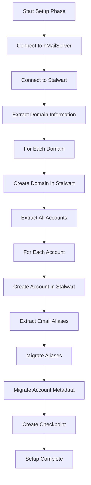

# Account, Domain, and Alias Migration Guide

This guide explains how the migration tool handles infrastructure migration - the critical components that Vandelay cannot migrate: domains, accounts, and email aliases.

## Overview

Our migration tool **complements Vandelay** by handling infrastructure migration that Vandelay cannot perform:

| Component | Vandelay Support | Our Tool Support |
|-----------|-----------------|------------------|
| Domains | ❌ Cannot create | ✅ Creates in Stalwart |
| Accounts | ❌ Cannot create | ✅ Creates with metadata |
| Aliases | ❌ Cannot migrate | ✅ Migrates all aliases |
| Email Messages | ✅ IMAP→JMAP migration | ✅ Fallback EML export |
| Contacts | ✅ JMAP migration | ✅ Fallback JSON export |
| Calendars | ✅ JMAP migration | ✅ Fallback JSON export |

## Migration Workflow

### Phase 1: Setup (Fills Vandelay's Gaps)

This phase must run **before** Vandelay data migration to ensure the target infrastructure exists.



## Domain Migration

### How It Works

The tool extracts all domains from hMailServer and creates equivalent domains in Stalwart with:

- **Domain name** - Preserved exactly
- **Domain description** - Migrated if available
- **Quotas** - Domain-level storage quotas
- **DNS settings** - MX records, SPF, DKIM, DMARC
- **Anti-spam settings** - Spam filtering configuration
- **Aliases** - Domain aliases

### CLI Commands

```bash
# Setup domains only
stalwart-migrate setup \
  --source hmailserver \
  --target stalwart \
  --source-config hmailserver-config.json \
  --target-config stalwart-config.json \
  --create-domains

# Setup domains and accounts
stalwart-migrate setup \
  --source hmailserver \
  --target stalwart \
  --source-config hmailserver-config.json \
  --target-config stalwart-config.json \
  --create-domains \
  --create-accounts

# Full setup (domains, accounts, aliases)
stalwart-migrate setup \
  --source hmailserver \
  --target stalwart \
  --source-config hmailserver-config.json \
  --target-config stalwart-config.json \
  --create-domains \
  --create-accounts \
  --migrate-aliases
```

### Domain Configuration Options

| Option | Type | Description | Default |
|--------|------|-------------|---------|
| `--create-domains` | flag | Create domains in Stalwart | false |
| `--domain-prefix` | string | Prefix for domain names | none |
| `--domain-suffix` | string | Suffix for domain names | none |
| `--skip-existing-domains` | flag | Skip if domain exists | false |
| `--dry-run` | flag | Preview without creating | false |

### Domain Mapping File

Create a `domain-mapping.json` file to customize domain migration:

```json
{
  "mappings": [
    {
      "source": "old-domain.com",
      "target": "new-domain.com",
      "description": "Updated domain name"
    },
    {
      "source": "internal.example.com",
      "target": "mail.example.com",
      "description": "Public domain name"
    }
  ],
  "defaults": {
    "quota": 10240,
    "maxAccounts": 100,
    "enableSpamFiltering": true
  }
}
```

Use with:

```bash
stalwart-migrate setup \
  --domain-mapping domain-mapping.json \
  --create-domains
```

## Account Migration

### How It Works

The tool extracts all accounts from each domain in hMailServer and creates equivalent accounts in Stalwart with:

- **Account name** - Username (without domain)
- **Full email address** - username@domain.com
- **Display name** - User's display name
- **Quota** - Individual storage quota
- **Password** - **NOT migrated** (users must reset passwords)
- **Account status** - Active, disabled, or locked
- **Forwarding addresses** - Email forwarding rules
- **Auto-reply** - Vacation/out-of-office messages
- **Custom metadata** - Additional account properties

### Password Migration

**Important**: For security reasons, **passwords are NOT migrated**. Users must reset their passwords after migration.

Options for password handling:

1. **Manual Reset** (Recommended): Users set new passwords via web interface
2. **Bulk Reset**: Use Stalwart admin API to set temporary passwords
3. **LDAP Integration**: Configure LDAP authentication in Stalwart

### CLI Commands

```bash
# Migrate accounts for all domains
stalwart-migrate setup \
  --create-accounts

# Migrate accounts for specific domains only
stalwart-migrate setup \
  --create-accounts \
  --domains domain1.com,domain2.com

# Migrate accounts with custom options
stalwart-migrate setup \
  --create-accounts \
  --account-prefix "mig-" \
  --default-quota 5120 \
  --skip-existing
```

### Account Configuration Options

| Option | Type | Description | Default |
|--------|------|-------------|---------|
| `--create-accounts` | flag | Create accounts in Stalwart | false |
| `--domains` | string | Comma-separated list of domains | all |
| `--account-prefix` | string | Prefix for account names | none |
| `--account-suffix` | string | Suffix for account names | none |
| `--default-quota` | integer | Default quota in MB | 10240 |
| `--skip-existing` | flag | Skip if account exists | false |
| `--password-reset` | flag | Force password reset | true |
| `--dry-run` | flag | Preview without creating | false |

### Account Mapping File

Create an `account-mapping.json` file to customize account migration:

```json
{
  "mappings": [
    {
      "source": "user1@old-domain.com",
      "target": "user1@new-domain.com"
    },
    {
      "source": "admin@internal.example.com",
      "target": "admin@mail.example.com",
      "quota": 20480,
      "isAdmin": true
    }
  ],
  "transforms": [
    {
      "pattern": "^(.+)@old-domain\\.com$",
      "replacement": "$1@new-domain.com"
    }
  ],
  "defaults": {
    "quota": 10240,
    "passwordResetRequired": true,
    "accountStatus": "active"
  }
}
```

Use with:

```bash
stalwart-migrate setup \
  --account-mapping account-mapping.json \
  --create-accounts
```

## Alias Migration

### How It Works

The tool extracts all email aliases from hMailServer and creates them in Stalwart:

- **Alias name** - The alias email address
- **Target address(es)** - Where emails are forwarded
- **Domain aliases** - Entire domain forwarding
- **Catch-all aliases** - Wildcard forwarding
- **Alias type** - Forward-only or forward-and-store

### CLI Commands

```bash
# Migrate all aliases
stalwart-migrate setup \
  --migrate-aliases

# Migrate aliases for specific domains
stalwart-migrate setup \
  --migrate-aliases \
  --domains domain1.com,domain2.com
```

### Alias Configuration Options

| Option | Type | Description | Default |
|--------|------|-------------|---------|
| `--migrate-aliases` | flag | Migrate email aliases | false |
| `--alias-types` | string | Types: all, forward, domain | all |
| `--validate-targets` | flag | Validate target addresses exist | true |
| `--skip-invalid` | flag | Skip aliases with invalid targets | true |
| `--dry-run` | flag | Preview without creating | false |

## Metadata Migration

### What Gets Migrated

| Metadata Type | Description | Migration |
|--------------|-------------|-----------|
| Quotas | Storage limits | ✅ Migrated |
| Forwarding | Email forwarding rules | ✅ Migrated |
| Auto-reply | Out-of-office messages | ✅ Migrated |
| DNS Records | MX, SPF, DKIM, DMARC | ✅ Migrated |
| Spam Settings | Spam filtering rules | ✅ Migrated |
| Custom Headers | Custom email headers | ✅ Migrated |
| Webmail Settings | Web interface preferences | ⚠️ Partial |
| Passwords | Account passwords | ❌ Not Migrated |

### Custom Metadata

The tool preserves custom metadata from hMailServer:

```json
{
  "customFields": {
    "department": "Sales",
    "location": "NYC",
    "employeeId": "12345"
  },
  "tags": ["vip", "admin", "internal"]
}
```

## Bulk Migration

### Batch Processing

For large migrations, the tool processes accounts in batches:

```bash
# Set batch size (default: 100)
stalwart-migrate setup \
  --create-accounts \
  --batch-size 50

# Set checkpoint frequency (default: every 30 seconds)
stalwart-migrate setup \
  --create-accounts \
  --checkpoint-interval 60
```

### Progress Tracking

```bash
# Show detailed progress
stalwart-migrate setup \
  --create-accounts \
  --verbose

# Save progress to file
stalwart-migrate setup \
  --create-accounts \
  --progress-file migration-progress.json
```

## Resume Capability

### How It Works

The tool creates checkpoints every 30 seconds (configurable) during migration. If the migration is interrupted:

1. **Checkpoint file** is saved with current state
2. **Already migrated** domains/accounts are skipped
3. **Resume** from where it left off

### CLI Commands

```bash
# Resume interrupted migration
stalwart-migrate setup \
  --create-domains \
  --create-accounts \
  --migrate-aliases \
  --resume

# Start fresh (ignore existing checkpoints)
stalwart-migrate setup \
  --create-domains \
  --create-accounts \
  --fresh-start
```

### Checkpoint Management

```bash
# List available checkpoints
stalwart-migrate checkpoint list

# View checkpoint details
stalwart-migrate checkpoint show --file migration-checkpoint.json

# Delete checkpoint
stalwart-migrate checkpoint delete --file migration-checkpoint.json
```

## Validation

### Pre-Migration Validation

```bash
# Validate hMailServer connectivity
stalwart-migrate validate --source hmailserver --source-config hmailserver-config.json

# Validate Stalwart connectivity
stalwart-migrate validate --target stalwart --target-config stalwart-config.json

# Validate all connections
stalwart-migrate validate --all --source-config hmailserver-config.json --target-config stalwart-config.json
```

### Post-Migration Validation

```bash
# Verify domain migration
stalwart-migrate validate \
  --target stalwart \
  --target-config stalwart-config.json \
  --validate-domains \
  --domain-list domains.txt

# Verify account migration
stalwart-migrate validate \
  --target stalwart \
  --target-config stalwart-config.json \
  --validate-accounts \
  --account-list accounts.txt

# Full validation report
stalwart-migrate validate \
  --target stalwart \
  --target-config stalwart-config.json \
  --full-report validation-report.json
```

## Common Migration Scenarios

### Scenario 1: Complete Migration

```bash
# Full migration: setup + Vandelay + fallback
stalwart-migrate migrate \
  --source hmailserver \
  --target stalwart \
  --source-config hmailserver-config.json \
  --target-config stalwart-config.json \
  --setup-first \
  --run-vandelay \
  --resume
```

### Scenario 2: Setup Only (For Vandelay-Only Migration)

```bash
# Just create the infrastructure, let Vandelay handle data
stalwart-migrate setup \
  --source hmailserver \
  --target stalwart \
  --source-config hmailserver-config.json \
  --target-config stalwart-config.json \
  --create-domains \
  --create-accounts \
  --migrate-aliases
```

### Scenario 3: Incremental Migration

```bash
# Migrate specific domains
stalwart-migrate setup \
  --source hmailserver \
  --target stalwart \
  --source-config hmailserver-config.json \
  --target-config stalwart-config.json \
  --create-domains \
  --create-accounts \
  --migrate-aliases \
  --domains sales.example.com,marketing.example.com
```

### Scenario 4: Fallback Migration (Without Vandelay)

```bash
# Migrate without Vandelay
stalwart-migrate migrate \
  --source hmailserver \
  --target stalwart \
  --source-config hmailserver-config.json \
  --target-config stalwart-config.json \
  --no-vandelay \
  --setup-first
```

## Troubleshooting Account Migration

### Common Issues and Solutions

**Issue: Domain already exists**

```bash
# Use skip-existing flag
stalwart-migrate setup --create-domains --skip-existing-domains

# Or delete existing domain first (destructive!)
# Use Stalwart admin API or web interface
```

**Issue: Account already exists**

```bash
# Use skip-existing flag
stalwart-migrate setup --create-accounts --skip-existing

# Or use account mapping to rename
stalwart-migrate setup --create-accounts --account-mapping account-mapping.json
```

**Issue: Invalid email address**

```bash
# Use validate flag to check before migration
stalwart-migrate validate --source hmailserver --validate-emails

# Or skip invalid addresses
stalwart-migrate setup --create-accounts --skip-invalid
```

**Issue: Quota exceeded**

```bash
# Increase default quota
stalwart-migrate setup --create-accounts --default-quota 20480

# Or set per-account quotas in mapping file
```

**Issue: Connection timeout**

```bash
# Increase timeout
stalwart-migrate setup --timeout-seconds 120

# Or check network connectivity
```

### Verification Commands

```bash
# List domains in Stalwart (after migration)
curl -u admin:password http://localhost:8080/api/v1/admin/domains

# List accounts in Stalwart
curl -u admin:password http://localhost:8080/api/v1/admin/accounts

# Check specific account
curl -u admin:password http://localhost:8080/api/v1/admin/accounts/user@domain.com

# Count migrated items
stalwart-migrate validate --target stalwart --count-items
```

## Best Practices

1. **Always backup first**: Backup hMailServer before any migration
2. **Test with one domain**: Migrate a single test domain first
3. **Verify connectivity**: Ensure both hMailServer and Stalwart are accessible
4. **Check quotas**: Verify disk space on both source and target
5. **Monitor progress**: Use verbose mode to track migration
6. **Validate after migration**: Run post-migration validation
7. **Document passwords**: Since passwords aren't migrated, plan for user communication
8. **Schedule downtime**: Plan migration during low-traffic periods
9. **Test email flow**: Verify email sending/receiving after migration
10. **Keep old server**: Don't decommission hMailServer until migration is verified

## Performance Tips

- **Batch size**: Larger batches are faster but use more memory (default: 100)
- **Parallel processing**: The tool processes domains sequentially but accounts in parallel
- **Network speed**: Migration speed depends on network latency between servers
- **Disk I/O**: Use fast storage (SSD) for intermediate files
- **Checkpoint frequency**: More frequent checkpoints = better resume capability but slower

## See Also

- [User Guide](user-guide.md) - General usage instructions
- [Configuration Reference](configuration.md) - Configuration file details
- [Migration Process Guide](migration-process.md) - Complete migration workflow
- [Docker Setup Guide](docker-setup.md) - Stalwart Docker configuration
- [Vandelay Integration Guide](vandelay-integration.md) - Vandelay setup and usage
- [Troubleshooting Guide](troubleshooting.md) - Common issues and solutions
